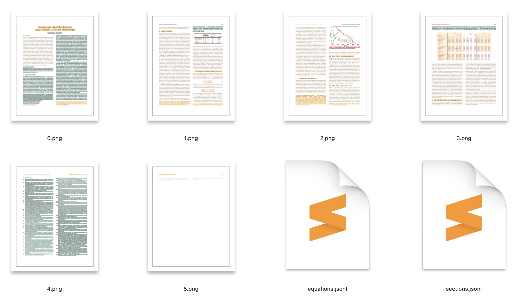

# Use VILA for Scientific Documents Parsing

All the command are executed in this folder `examples/vila_for_scidoc_parsing`.

## Installation

1. Install the necessary python dependencies
    ```bash
    git clone git@github.com:allenai/mmda.git
    cd mmda
    pip install .[heuristic_predictors,lp_predictors,vila_predictors]
    ```
2. Install poppler for rendering PDF images - the installation methods are different based on your platform:

    - Mac: brew install poppler
    - Ubuntu: sudo apt-get install -y poppler-utils
    - Windows: See [this post](https://stackoverflow.com/questions/18381713/how-to-install-poppler-on-windows)

3. Download the VILA models

    For now, please contact @shannons for downloading the weights.

## Usage

```bash
python main.py --pdf-path <path-to-pdf-files> \
               --export-folder <the-folder-for-saving-visualizations>
```

It will run PubLayNet-based layout detection models to identify equations,
and run VILA models based on the detected layouts to perform section
identification. All detected equations and section categories will visualized
and stored in the export-folder, alongside two jsonl files for the detected
equations and section categories.

If you see an error reading `SSL:CERTIFICATE_VERIFY_FAILED`, then you may need
to download a certificate for Python. See [this Stack Overflow
answer](https://stackoverflow.com/a/53310545/2096369) for a fix that might work
on Mac, as well as other answers.

## Expected Output

The output of the script should look something like this:


