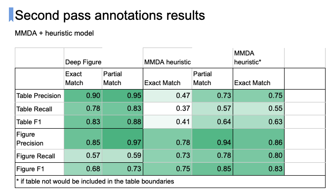

# Example of making a call to FAST API for figure_table_predictor once it is running locally
Can be found in [src/ai2_internal/figure_table_predictors/figure_table_timo_service_invocation.ipynb](https://github.com/allenai/mmda/blob/063c1d327ab40a77b361366aa1f6e56fa256f153/src/ai2_internal/figure_table_predictors/figure_table_timo_service_invocation.ipynb)

# Link to the service
Only available through the internal network (VPN) http://mmda-figure-cap-pred.v2.prod.models.s2.allenai.org/docs

# Config for the service setup
https://github.com/allenai/timo/blob/main/timo_services/configs/timo_figure_table_predictor_v2.py

# Performance of the model evaluated using annotators are as follows:

Exact match -- model predicted figure/table and captions exactly as the annotators found it 
reasonable (may include more information). 
Partial match -- some information is not included in the prediction either in the figure/table or corresponding caption.
More details on annotation guidelines can be found [here](https://docs.google.com/spreadsheets/d/1dVLBhE9G6_rHNMIX0Cv6jqaMgviVOTv7UMA2dISuNo8/edit#gid=2118988502) 
and [here](https://docs.google.com/document/d/1A7EO40R0dK_TfUfa0ObpDLUq8Ard3wCErrLgrhNWBIg/edit)

Here is the link to the [annotation_set](https://docs.google.com/spreadsheets/d/1dVLBhE9G6_rHNMIX0Cv6jqaMgviVOTv7UMA2dISuNo8/edit#gid=379619488&range=T4:Z12)
Link to the design considerations [design_considerations](https://docs.google.com/document/d/1Kfbcyw7pXC4uJCiodhUn_vgnA2J981gUK7KbQtkaG5Y/edit?usp=sharing)
