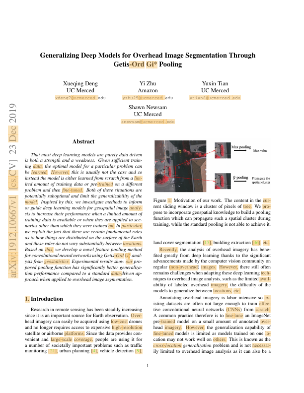
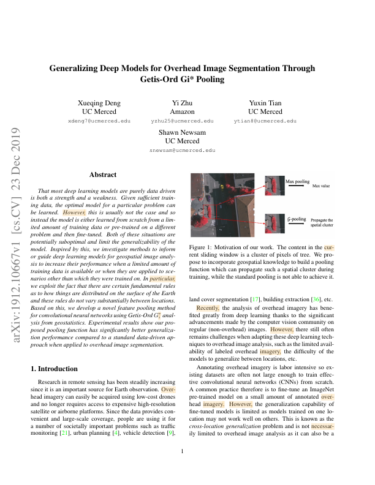
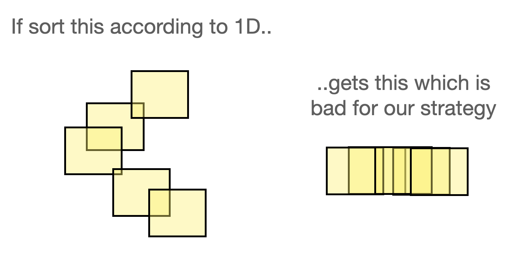
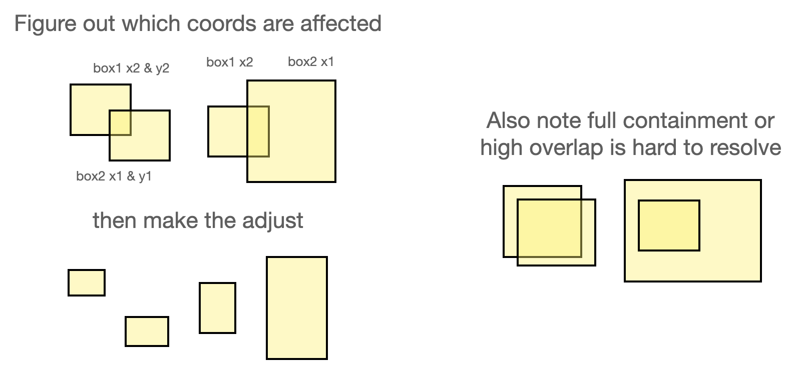

# notes


## bounding boxes


**1. Problem**

Token boxes from PDFPlumber aren't necessarily disjoint, which is annoying.

Here's an example (converted to xy coordinates for ease):

```
Token=0
(0.8155551504075421,
 0.9343934350623241,
 0.8317358800186805,
 0.9445089287110585,
 'Vol')

Token=1
(0.8315880494325322,
 0.9343934350623241,
 0.8343161957041776,
 0.9445089287110585,
 '.')
```

We see that Token0 and Token1 are on the same line given their ymin and ymax hovering at 0.93-0.94. They should be disjoint but Token0's xmax (0.8317) extends into Token1's xmin (0.8316). This should never be the case.

The weird thing is though, while boxes are kind of messed up like this, the text isn't. The two tokens together spell out `Vol.` correctly.

Why is this bad? Because it messes up our ability to lookup overlapping entities based on bounding box overlap. This is *especially* bad when we're trying to go from a bounding box (e.g. from LayoutParser) to token spans.

**2. Solutions**

There are a few solutions:

1. Fix this in PDFPlumberParser with posthoc operator over bounding boxes to enforce disjointness.

    ➔ Kind of problematic because requires so much reprocessing.

    ➔ May also make it harder to keep in-sync w/ PDFPlumber over time. Posthoc corrections maybe should still be decoupled from the parser itself?

2. Apply fixes at `Document.from_json()` time to adjust all token bounding boxes "inward". 

    ➔ Not as risky. Somewhat hacky but fairly straightforward. Problem is it doesn't quite fix the data, which is still being generated with weird boxes. 

3. Overlapping bounding boxes primarily affects vision-based lookup methods (e.g. give me all entities within a visual region). A different way to fix this is to base all bounding box-based lookup methods not on the bounding boxes, but instead on the box centroid or something else.

    ➔ Not sure whether it would work. Seems dependent on box quality. For example, if the box is extremely off-center, then it's not like this would solve anything. And it's actually quite a bit of code to refactor. Let's rule it out.


Thinking about it, #2 is pretty reasonable for now given that we're aiming for overall stability. We can worry about #1 later.

**2. Implementation details of Approach 2**

There are a few ways to do #2 actually. 

If the Boxes are actually pretty good, but only overlap with each other slightly (e.g. boundaries kinda fuzzy), then the easiest way to fix things is to shrink all boxes to avoid all overlapping regions. 

But if the Boxes are pretty poor quality (imagine something that's really big/off-center), then there's no real way to resolve that box without actually pulling up the original image and trying to do some pixel-based localization.

We *really* don't want to do the latter, so let's investigate whether the former is the more common case.

See this example where we cluster all the token boxes on a page and only shade the ones that have some overlap with another box: .

The overlapping regions are really small. Let's go with the easier implementation.


**3. Global epsilon-based adjustment to all boxes**

Before we do that, there are actually boxes out of PDFPlumber that are perfectly shared borders:

```
{'x1': 0.38126804444444445, 'y1': 0.12202539797979782, 'x2': 0.3861468209150327, 'y2': 0.13334661010100995}
{'x1': 0.3861468209150327, 'y1': 0.12202539797979782, 'x2': 0.42277427189542477, 'y2': 0.13334661010100995}
```

As you can see, `x2` of the first box is exactly `x1` of the second box.

One way to make this way less annoying is to apply a very small shrinkage. How big is this? Well, looking at the size of typical images rendered at `dpi=72`, we're probably looking at pages that have dimension `(800, 620)` at most. So conservatively, we can set an `epsilon=1e-4` without worrying about it being perceptible.

For example, just doing something like this:
```
BUFFER = 1e-4
for token in doc.tokens:
    token.box_group.boxes[0].l += BUFFER
    token.box_group.boxes[0].t += BUFFER
    token.box_group.boxes[0].w -= 2 * BUFFER
    token.box_group.boxes[0].h -= 2 * BUFFER
```

will fix a lot of the overlapping boxes from the first figure:




**5. Clustering-based solution***

Now how do we fix the remaining boxes? 

One thought is -- Can we do a fast thing just writing rules to compare `xmin, xmax, ymin, ymax` and directly make adjustments to those boundaries? Probably, but it gets confusing really quickly. Consider this case:



The problem is that we don't really want to work off clusters of boxes, but actually *pairs* of boxes that overlap. But the O(N^2) over all boxes on a page is kind of costly to check. So let's pre-cluster and then perform the O(N^2) within each cluster.


The technique looks something like:



The figure above is what would happen if you just swapped the correct coordinates of the overlapping boxes. It does create more whitespace between, which may not be desirable, but it's also easier to follow. You can instead replace the relevant box coordinates with something newly calculated (e.g. split the difference).

**6. Boxes that aren't even on the page**

If we look at PDF in test fixtures `4be952924cd565488b4a239dc6549095029ee578.pdf`, we'll actually find weird boxes that come out of PDFPlumber that are off the page:

```

```